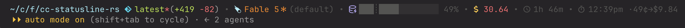

# cc-statusline-rs

Ceej's informative ANSI statusline for Claude Code, in Rust. It reads the status-hook JSON on stdin and prints where you are, what the model is doing, and what it's costing you. It fits everything into one line and splits into two when it can't. It requires that you use a [Nerd Font](https://www.nerdfonts.com/) in your terminal but otherwise needs nothing.

This is a fork of [khoi/cc-statusline-rs](https://github.com/khoi/cc-statusline-rs), which in turn grew from [steipete's gist](https://gist.github.com/steipete/8396e512171d31e934f0013e5651691e). The idea came from upstream; the code here has been rewritten from the ground up and has diverged considerably. Thanks to both for the starting point.

## Installing

macOS, via [Homebrew](https://brew.sh):

```bash
brew install ceejbot/tap/cc-statusline-rs && cc-statusline-rs setup
```

Linux, any distro — the release binaries are static musl builds:

```bash
curl -fsSL https://raw.githubusercontent.com/ceejbot/cc-statusline-rs/main/scripts/install-linux.sh | bash
```

Windows, in PowerShell:

```powershell
irm https://raw.githubusercontent.com/ceejbot/cc-statusline-rs/main/scripts/install.ps1 | iex
```

Anywhere with a Rust toolchain:

```bash
cargo install cc-statusline-rs && cc-statusline-rs setup
```

`cc-statusline-rs setup` rewrites the `statusLine` entry in `~/.claude/settings.json` to point to this binary and set `refreshInterval: 10`. The Linux and Windows scripts download the latest release for your architecture to `~/.claude/`, verify its checksum, and run setup for you; `scripts/install-macos.sh` exists if you'd rather one command than two. Releases ship for ARM and Intel on all three OSes.

From a clone, `just install` builds from source, copies the binary to `~/.claude/`, ad-hoc codesigns it (macOS), and runs the same setup.

## What it shows



The components come in two groups, and the layout adapts: when the whole thing fits your terminal width with room to spare, it renders as one line; when it doesn't (long branch names were crowding the money out), the groups split into two.

The first group is identity — where you are, what the model is doing:

- **Vim mode badge** (`[N]`, `[I]`, `[V]`), when you have vim keybindings on
- **Working directory**, fish-style shortened (`~/c/f/cc-statusline-rs`)
- **Git branch**, with a red `*` when dirty, `↑`/`↓` ahead-behind counts, a `↟name` worktree marker, and a `#1234` PR badge colored by review state
- **Lines added and removed** this session
- **Model name**, with a reasoning-effort suffix (`·max`), a `✻` glyph when extended thinking is on, and the output style in parens
- **Context-window usage** as a progress bar with a percentage, color-shifting as it fills; 1M-context models get a `┊` tick at the 200k boundary

The second group is accounting:

- **Session cost** in dollars, color-coded by how much you should wince
- **Agent name**, when running as a sub-agent
- **Session duration**
- **Rate-limit windows** (5h and 7d) with usage percentages, plus a reset countdown once a window passes half used — subscribers only; API users never see this
- **Cache expiry**: the local wall-clock time your prompt cache goes cold (`󰔛 3:42pm`), so you know whether your next message reheats a warm cache or pays to rebuild it. Shifts gray → yellow → orange → red as expiry approaches, then flips to `󰜗 cold`.
- **Next-message cost**, glued to the cache clock: `·20¢→$4.00` is what re-sending your context costs against a warm cache versus what it will cost after expiry. Once cold, only the rebuild figure remains.

Components with no data vanish from the line, and an empty second line vanishes entirely. In a fresh session outside a git repo, you get one short line; deep in a long session in a narrow terminal, you get the full two-row instrument panel. The width check reads the `COLUMNS` environment variable, which Claude Code sets for statusline processes (v2.1.153+); when it's absent, the split layout is assumed.

### Cache rules what?

The cache indicator works out the TTL by reading the tail of your session transcript: it finds the most recent cache-creation usage record and infers the tier (1-hour or 5-minute) from which bucket the tokens landed in. Failing that, it falls back to the [`FORCE_PROMPT_CACHING_5M`](https://code.claude.com/docs/en/prompt-caching#override-the-ttl) and [`ENABLE_PROMPT_CACHING_1H`](https://code.claude.com/docs/en/prompt-caching#cache-lifetime) environment variables, then to a heuristic (rate limits present means a subscriber plan, which means 1h). Setting [`DISABLE_PROMPT_CACHING=1`](https://code.claude.com/docs/en/prompt-caching#disable-prompt-caching) suppresses the indicator entirely.

An absolute time stays true even when the line isn't redrawing, but the color bands and the `cold` flip only stay current if the statusline refreshes while you're idle. Set `refreshInterval` in your settings (the install recipe uses 10 seconds).

The cost projection rides on the same machinery. Warm cost is your context re-read at the cache-read rate (0.1× the base input price); cold cost is the full rewrite at the cache-write rate for the detected TTL tier (1.25× for 5-minute, 2× for 1-hour — the same tier detection that sets the clock). Base prices are matched by model family (Fable and Mythos $10/MTok, Opus $5, Sonnet $3, Haiku $1), so treat the figures as good estimates, not invoices. Output tokens aren't included — nobody knows how much the model is going to say next, least of all the model. An unrecognized model family drops the projection and keeps the clock.

One footnote for the static Linux builds: they read `/usr/share/zoneinfo` for the cache clock's local time, so in a container without `tzdata` the expiry time shows in UTC. Everything else is unaffected.

## Development

- [Rust](https://rustup.rs/) 1.85 or later
- `git` on your PATH
- For the install recipe: [just](https://just.systems/) (`brew install just`)

The interesting recipes:

```bash
just run     # render the sample test.json through a debug build
just test    # unit tests, via cargo-nextest
just ci      # everything CI checks: tests, clippy, formatting
```

`just test` wants [cargo-nextest](https://nexte.st/), and `just fmt` uses nightly rustfmt; plain `cargo test` and `cargo fmt` work fine if you'd rather not install either. All the logic lives in `src/lib.rs`, and the parsers are pure functions with tests, so most changes don't require a live Claude Code session to verify — pipe `test.json` in and look at the line.

## License

[Apache-2.0](./LICENSE).
