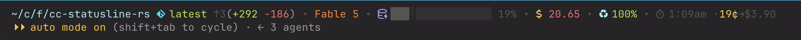

# cc-statusline-rs

Ceej's informative ANSI statusline for Claude Code, in Rust. It reads the status-hook JSON on stdin and prints where you are, what the model is doing, and what it's costing you. It fits everything into one line and splits into two when it can't. It asks for a [Nerd Font](https://www.nerdfonts.com/) in your terminal and nothing else.

For me this is two tools in one: an agent command-line prompt, and a running meter on what the session is costing my employer. The meter is the harder half; see the cache section below.

This is a fork of [khoi/cc-statusline-rs](https://github.com/khoi/cc-statusline-rs), which in turn grew from [steipete's gist](https://gist.github.com/steipete/8396e512171d31e934f0013e5651691e). The idea came from upstream; the code here has been rewritten from the ground up. Thanks to both for the starting point.

## Installing

macOS, via [Homebrew](https://brew.sh):

```bash
brew install ceejbot/tap/cc-statusline-rs && cc-statusline-rs setup
```

Linux, any distro — the release binaries are static musl builds:

```bash
curl -fsSL https://raw.githubusercontent.com/ceejbot/cc-statusline-rs/main/scripts/install-linux.sh | bash
```

Windows, in PowerShell:

```powershell
irm https://raw.githubusercontent.com/ceejbot/cc-statusline-rs/main/scripts/install.ps1 | iex
```

Anywhere with a Rust toolchain:

```bash
cargo install cc-statusline-rs && cc-statusline-rs setup
```

Prefer not to pipe curl into bash? Download the latest release from GitHub, put the binary wherever you like, and run `cc-statusline-rs setup` yourself. Setup rewrites the `statusLine` entry in `~/.claude/settings.json` to point at the binary, with `refreshInterval: 10`. Releases ship for ARM and Intel on all three OSes. Linux builds statically link musl, alas.

From a clone, `just install` builds from source, copies the binary to `~/.claude/`, ad-hoc codesigns it (macOS), and runs the same setup.

## What it shows



The components come in two groups, and the layout adapts: when the whole thing fits your terminal width with room to spare, it renders as one line; when it doesn't (long branch names were crowding the money out), the groups split into two.

The first group is identity — where you are, what the model is doing:

- **Vim mode badge** (`[N]`, `[I]`, `[V]`), when you have vim keybindings on
- **Working directory**, fish-style shortened (`~/c/f/cc-statusline-rs`)
- **Git branch**, with a red `*` when dirty, `↑`/`↓` ahead-behind counts, a `↟name` worktree marker, and a `#1234` PR badge colored by review state
- **Lines added and removed** this session
- **Model name**, with a reasoning-effort suffix (`·max`) and the output style in parens — both shown only when they deviate from the defaults
- **Context-window usage** as a progress bar with a percentage, color-shifting as it fills; 1M-context models get a `┊` tick at the 200k boundary

The second group is accounting:

- **Session cost** in dollars, color-coded by how much you should wince
- **Agent name**, when running as a sub-agent
- **Rate-limit windows** (5h and 7d) with usage percentages, plus a reset countdown once a window passes half used — subscribers only; API users never see this
- **Cache hit rate** (`󰑌 98%`): how much of your last message was served from the prompt cache. Green in the high 90s means caching is working; a sudden red single-digit means something broke your prefix — a model or effort switch, `/compact`, an MCP server change — and that turn paid to rebuild it.
- **Cache expiry**: the local wall-clock time your prompt cache goes cold (`󰔛 3:42pm`), so you know whether your next message reheats a warm cache or pays to rebuild it. Shifts gray → yellow → orange → red as expiry approaches, then flips to `󰜗 cold`.
- **Next-message cost**, glued to the cache clock: `·20¢→$4.00` is what re-sending your context costs against a warm cache versus what it will cost after expiry. The figure that applies right now renders gold; the one that merely looms stays gray. Once cold, only the rebuild figure remains — in gold, because it is now the floor.

Components with no data vanish from the line, and an empty second line vanishes entirely. In a fresh session outside a git repo, you get one short line; deep in a long session in a narrow terminal, you get the full two-row instrument panel. The width check reads the `COLUMNS` environment variable, which Claude Code sets for statusline processes (v2.1.153+); absent that, you get the split layout.

### Cache rules what?

This tool exists to show me _context size_ and _the projected cost of my next message_. Cache breaks dominate session cost, and knowing when your cache is about to go cold is hard — harder still on a pay-as-you-go API account, where the cache times out after 5 minutes by default.

When does your cache expire?

The cache indicator works out the TTL by reading the tail of your session transcript: it finds the most recent cache-creation usage record and infers the tier (1-hour or 5-minute) from which bucket the tokens landed in. Failing that, it falls back to the [`FORCE_PROMPT_CACHING_5M`](https://code.claude.com/docs/en/prompt-caching#override-the-ttl) and [`ENABLE_PROMPT_CACHING_1H`](https://code.claude.com/docs/en/prompt-caching#cache-lifetime) environment variables, then to a heuristic (rate limits present means a subscriber plan, which means 1h). Setting [`DISABLE_PROMPT_CACHING=1`](https://code.claude.com/docs/en/prompt-caching#disable-prompt-caching) suppresses the indicator entirely.

An absolute time stays true even when the line isn't redrawing, but the color bands and the `cold` flip only stay current if the statusline refreshes while you're idle. `refreshInterval` in your settings keeps the line updating when you're not doing anything; the number is _seconds_.

The cost projection uses your TTL tier, your model family, and the size of the context that gets re-read. It leaves out output tokens: nobody knows what the model says next, least of all the model. The projection is _only_ the cache re-warm cost.

At the time of writing, here's how to guess the cost of your next message: divide your context size by 1,000,000 to get MTok, multiply by your model's base price per MTok, then apply the warmth multiplier:

- warm: `0.1` × base
- cold, 5-minute TTL tier: `1.25` × base
- cold, 1-hour TTL tier: `2.0` × base

Worked out as effective $ per MTok of context:

| Model        | Base $/MTok |  Warm | Cold 5min | Cold 1 hour |
|--------------|-------------|-------|-----------|-------------|
| Fable/Mythos |         $10 | $1.00 |    $12.50 |      $20.00 |
| Opus         |          $5 | $0.50 |     $6.25 |      $10.00 |
| Sonnet       |          $3 | $0.30 |     $3.75 |       $6.00 |
| Haiku        |          $1 | $0.10 |     $1.25 |       $2.00 |

These are _estimates_, not your bill. The cost data Anthropic sends in the statusline JSON is plain wrong anyway, so read every dollar figure here as directional, not a prediction of what you'll pay.

## Development

- [Rust](https://rustup.rs/) 1.85 or later
- `git` on your PATH
- For the install recipe: [just](https://just.systems/) (`brew install just`)

The interesting recipes:

```bash
just run     # render the sample test.json through a debug build
just test    # unit tests, via cargo-nextest
just ci      # everything CI checks: tests, clippy, formatting
```

`just test` wants [cargo-nextest](https://nexte.st/), and `just fmt` uses nightly rustfmt; plain `cargo test` and `cargo fmt` work fine if you'd rather not install either. All the logic lives in `src/lib.rs`, and the parsers are pure functions with tests, so most changes don't require a live Claude Code session to verify — pipe `test.json` in and look at the line.

## License

[Apache-2.0](./LICENSE).
